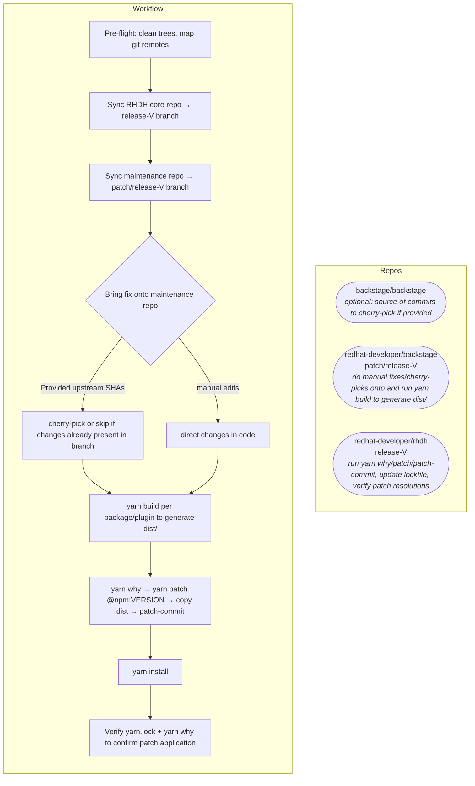

# patch-backstage workflow (Mermaid)

Companion diagram for [`SKILL.md`](./SKILL.md). Render in GitHub, GitLab, VS Code (Mermaid preview), or docs tooling.

## Overview

One flow: **maintenance fork** produces **`dist/`**; **RHDH** pins that onto the **lockfile version** with **`yarn patch`**. Upstream **backstage/backstage** is only needed to **fetch** commit objects for cherry-pick / `git show` (optional).

Step-by-step detail, troubleshooting, and **dynamic-plugins** (second Yarn project) are in [`SKILL.md`](./SKILL.md).
