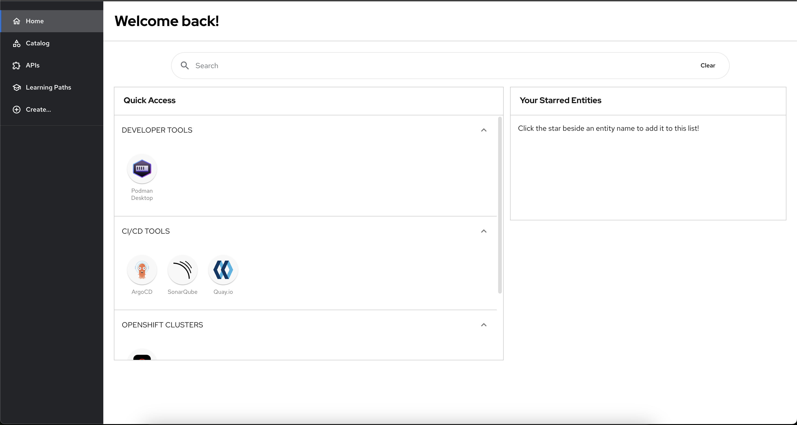

# Customizing the look of your showcase instance

To customize the look of your showcase instance, you can edit the `app-config.yaml` file in the root of this repository. The customizations used to configure the app are loaded by the backstage app at startup, with certain values being queried by the app at runtime.

Plugins can use field `developerHub.flavor` of the `app-config.yaml` to identify which Backstage flavor they are running on (e.g `backstage`, `rhdh` or `rhtap`).

## Changing the Sidebar Logo

The sidebar uses two logos - one for the expanded sidebar and one for the collapsed sidebar.

- To customize the logo for the expanded sidebar, provide a both light and dark mode Base64 encoded images of your logo in the `app.branding.fullLogo` field of the `app-config.yaml`. You may also opt to provide a single Base64 encoded image that will be used for both light and dark modes.
- To change the width of logo, provide your required size of logo in the `app.branding.fullLogoWidth` field of `app-config.yaml`
- Similarly, to customize the logo for the collapsed sidebar, provide either a string value of a Base64 encoded image, or both light and dark mode Base64 encoded images of your logo in the `app.branding.iconLogo` field of the `app-config.yaml`.

```yaml title="app-config.yaml"
app:
  branding:
    fullLogo:
      light: ${BASE64_EMBEDDED_FULL_LOGO_LIGHT} # SVG Example: data:image/svg+xml;base64,PD94...
      dark: ${BASE64_EMBEDDED_FULL_LOGO} # SVG Example: data:image/svg+xml;base64,PD94...
    fullLogoWidth: ${FULL_LOGO_WIDTH} # The following units are supported: <number>, px, em, rem, <percentage>
    iconLogo: ${BASE64_EMBEDDED_ICON_LOGO} # PNG Example: data:image/png;base64,iVBO...
```


## Hiding Sidebar search, logo, settings, administration

```yaml title="app-config.yaml"
app:
  sidebar:
    search: false # optional, when set to false hides sidebar search
    logo: false # optional, when set to false hides sidebar logo
    settings: false # optional, when set to false hides settings menu item
    administration: false # # optional, when set to false hides administration menu item
```



## Customizing the Sidebar Menu Items

Order and parent-children relationship of sidebar main menu items can be customized using the `dynamicPlugins.frontend.default.main-menu-items.menuItems` field in the `app-config.yaml`. To ensure the menu item is recognized as a main menu item, the key must be prefixed with `default.`.

```yaml title="app-config.yaml"
dynamicPlugins:
  frontend:
    default.main-menu-items: # key for configuring static main menu items
      default.<menu_group_parent_item_name>: # must be configured if it is specified as the parent of any menu items. `default.` prefix is required for a main menu item key
        icon: my_menu_group_icon # required for parent menu items, defines the icon for the menu group
        title: my_menu_group_title # required for parent menu items, defines the icon for the menu group
        priority: 100 # optional, specifies the order of the parent menu item in the sidebar
      default.<menu_item_name>: # key of the menu item configuration. `default.` prefix is required for a main menu item key
        parent: my_menu_group # optional, specifies the parent menu item for this item
        priority: 10 # optional, specifies the order of this menu item within its menu level
        icon: my_menu_group_icon # optional, defines the icon for the menu group
        title: my_menu_group_title # required for new menu items, for default menu items if not provided will pick the default title and if provided as empty string '', then this will be hidden
        to: </path/to/the/target/page> # optional, specifies the target navigation path
```

`default.<menu_item_name>`: The `default.` prefix is mandatory to ensure that the menu item is recognized as a main menu item. It should be used for both individual menu items and parent menu group configurations.

See [Menu items](dynamic-plugins/frontend-plugin-wiring.md#menu-items) from dynamic-plugins documentation for more details.

See [DefaultMainMenuItems](https://github.com/redhat-developer/rhdh/blob/main/packages/app/src/consts.ts#L1) for a list of main menu items, including their default priorities.

## Changing the favicon and tab title

Currently, the favicon customization utilizes the same Base64 encoded image as the icon logo provided via `app.branding.iconLogo` in the `app-config.yaml`
Currently the favicon is only loaded once at startup, so if any changes need to be made to the favicon, the app will need to be restarted.

```yaml title="app-config.yaml"
app:
  branding:
    iconLogo: ${BASE64_EMBEDDED_ICON_LOGO}
```

To customize the tab title, provide a string value to the `app.title` field in the `app-config.yaml`:

```yaml title="app-config.yaml"
app:
  title: my-custom-title
```

You should then see the title of the tab in the form of `<page title> | my-custom-title`


## Customizing the your showcase colors

For all the color related customizations, the supported color formats are:

- Hexadecimal (`#nnn` or `#nnnnnn`)
- [hsl()](https://developer.mozilla.org/en-US/docs/Web/CSS/color_value/hsl) and [hsla()](https://developer.mozilla.org/en-US/docs/Web/CSS/color_value/hsl#legacy_syntax_hsla)
- [rgb()](https://developer.mozilla.org/en-US/docs/Web/CSS/color_value/rgb) and [rgba()](https://developer.mozilla.org/en-US/docs/Web/CSS/color_value/rgb#**legacy_syntax_rgba)
- [color()](https://developer.mozilla.org/en-US/docs/Web/CSS/color_value/color)

Currently, color customization between light mode and dark mode are separate and can be configured in their corresponding `app.branding.theme.[light or dark]` fields in the `app-config.yaml` file.

### Customizing the primary colors

To customize the color of links and buttons, provide your color in a [supported format](#customizing-the-your-showcase-colors) to the `app.branding.theme.[light or dark].primaryColor` field of the `app-config.yaml` file:

```yaml title="app-config.yaml"
app:
  branding:
    theme:
      light:
        primaryColor: "#38be8b"
      dark:
        primaryColor: "#ab75cf"
```


### Customizing the header banner colors

The header banner is a comprised of a pattern of two colors. It is possible to provide different customizations depending on whether the app is in light mode or dark mode. To customize the header banner colors, provide your colors in a [supported format](#customizing-the-your-showcase-colors) to the `app.branding.theme.[light or dark].headerColor[1 or 2]` fields of the `app-config.yaml` file.

Example configurations:

```yaml title="app-config.yaml"
app:
  branding:
    theme:
      light:
        headerColor1: "hsl(204 100% 71%)"
        headerColor2: "color(a98-rgb 1 0 0)"
      dark:
        headerColor1: "#0000d0"
        headerColor2: "rgb(255 246 140)"
```


### Customizing navigation indicator color

To customize the navigation indicator color of the sidebar for both light mode or dark mode. Provide the color in a [supported format](#customizing-the-your-showcase-colors) in the `app.branding.theme.[light or dark].navigationIndicatorColor` field of the `app-config.yaml` file:

```yaml title="app-config.yaml"
app:
  branding:
    theme:
      light:
        navigationIndicatorColor: "#be0000"
      dark:
        navigationIndicatorColor: "#f4eea9"
```


## Customizing Support button content

To customize the Support button content, provide your support team links and icons to the `app.support` field of the `app-config.yaml` file.

Example configurations:

```
app:
  support:
    url: https://github.com/redhat-developer/rhdh/issues # Used as contact support link on common ErrorPage
    items:                                                      # Used by common SupportButton component
      - title: Issues
        icon: github
        links:
          - url: https://github.com/redhat-developer/rhdh/issues
            title: GitHub Issues
      - title: Join the community
        icon: chat
        links:
          - url: https://janus-idp.io/community/
            title: Janus Community
```


If support is not configured, it would look as below.


## Customizing Build info content in the user settings page

To customize the build info content in the user settings page, provide your content to the `buildInfo` field in the `app-config.yaml` file.

Example configurations:

```
buildInfo:
  title: <Specify the title you want to display in the build info card.>
  card:
    TechDocs builder: 'local'
    Authentication provider: 'Github'
    RBAC: disabled
  overrideBuildInfo: true # If set to true, only the information specified in this configuration will be displayed. If set to false, the provided details will be shown along with the build versions. By default it will only display the configured information.
```

## Customizing the Language dropdown

To customize the language dropdown in the User settings page, configure the list of locales your app should support in the `app-config.yaml` file.

Example configuration:

```
i18n:
  locales: # List of supported locales. Must include `en`, otherwise the translation framework will fail to load.
    - en
    - de
    - it
  defaultLocale: en # Optional. Used as fallback when browser language preferences don't match supported locales, or defaults to 'en' if not specified.
  overrides: # List of JSON translation files applied in order (last file wins).  Each file may override/add translations for one or more plugins/locales
    - <path-to>/<overrides-1>.json
    - <path-to>/<overrides-2>.json

```

Example of JSON translation file, where the top-level key is the plugin translation reference ID (defined as translationRef in the [plugin source](https://github.com/backstage/community-plugins/blob/main/workspaces/npm/plugins/npm/src/translations/ref.ts#L23)
)

```
{
  "plugin.npm.translation-ref": {
    "en": {
      "infoCard.title": "NPM Packet JSON {{packageName}}"
    },
    "de": {
      "infoCard.title": "NPM Paket JSON {{packageName}}"
    },
    "zh": {
      "infoCard.title": "NPM 包 JSON {{packageName}}"
    }
  },
  "extensions": {
    "en": {
        "catalogPage.installationAlert": "Backend restart required JSON"
    }
  }
}
```

### Customizing Translations

In a translation override JSON file, you can:

1. **Modify Existing Translations**: Edit any English value in the JSON file to override the default translation
2. **Add Other Languages**: Add new language sections (e.g., `"de"`, `"fr"`, `"es"`) to support additional locales by translating the English keys
3. **Add Custom Keys**: Add new translation keys for custom components or plugins

### Example Translation Override File

You can add other languages as needed:

```json
{
  "rhdh": {
    "en": {
      "app.userSettings.infoCard.title": "Custom RHDH Metadata",
      "menuItem.home": "Dashboard"
    },
    "de": {
      "app.userSettings.infoCard.title": "Benutzerdefinierte RHDH-Metadaten",
      "menuItem.home": "Dashboard"
    },
    "fr": {
      "app.userSettings.infoCard.title": "Métadonnées RHDH personnalisées",
      "menuItem.home": "Tableau de bord"
    }
  }
}
```

### Applying Translation Overrides

To apply your custom translations:

#### For Local Development

1. **Save the JSON file** in your project directory (e.g., `translations/custom-overrides.json`)
2. **Update app-config.yaml** to include your override file:

```yaml
i18n:
  locales:
    - en
    - de
    - fr
  defaultLocale: en
  overrides:
    - translations/custom-overrides.json
```

3. **Restart the application** for changes to take effect

#### For OpenShift Environment

1. **Create a ConfigMap** with your translation overrides:

```yaml
apiVersion: v1
kind: ConfigMap
metadata:
  name: translation-overrides
  namespace: your-namespace
data:
  custom-overrides.json: |
    {
      "rhdh": {
        "en": {
          "app.userSettings.infoCard.title": "Custom RHDH Metadata"
        },
        "de": {
          "app.userSettings.infoCard.title": "Benutzerdefinierte RHDH-Metadaten"
        }
      }
    }
```

2. **Mount the ConfigMap** in your Backstage CR to `/src/translations/`:

```yaml
apiVersion: apps/v1
kind: Backstage
metadata:
  name: rhdh
spec:
  application:
    appConfig:
      mountPath: /opt/app-root/src
    extraFiles:
      configMaps:
        - mountPath: /opt/app-root/src/translations/
          name: translation-overrides
      mountPath: /opt/app-root/src
```

3. **Update your app-config.yaml** to reference the mounted file:

```yaml
i18n:
  locales:
    - en
    - de
    - fr
  defaultLocale: en
  overrides:
    - /opt/app-root/src/translations/custom-overrides.json
```

4. **Apply the ConfigMap and deployment** for changes to take effect

### Default Language Selection Priority

Default language selection follows this priority order:

1. **Browser Language Priority**: The system first checks the user's browser language preferences to provide a personalized experience.

2. **Configuration Priority**: If no browser language matches the supported locales, the `defaultLocale` from the `i18n` configuration is used as a fallback.

3. **Fallback Priority**: If neither browser preferences nor configuration provide a match, defaults to `en`.

## Language Preferences

Red Hat Developer Hub automatically saves and restores user language settings across browser sessions. This feature is enabled by default and uses database storage.

### Configuration (Optional)

Language preferences use database storage by default. To opt-out and use browser storage instead, add the following to your `app-config.yaml`:

```yaml title="app-config.yaml"
userSettings:
  persistence: browser # opt-out of database storage
```

### Persistence Options

- **`database`** (default): Stores language preferences in the backend database. Persists across devices and browsers. No configuration required.
- **`browser`** (opt-out): Stores language preferences in browser local storage. Limited to single browser/device.

## How It Works

When users change the language in the UI:

- The preference is automatically saved to storage
- On next login/refresh, the language setting is restored
- Guest users cannot persist language preferences

## Usage

1. Change language using any language selector in the UI
2. Language setting will automatically be saved and restored

## Customizing QuickAccess card icons on the Homepage

1. Add the JSON Data source

The QuickAccess Cards on the Homepage supports loading data from a JSON file. This JSON file in your GitHub repository or any accessible endpoint can be hosted.

2. Configure the Proxy in `app-config.yaml`

To allow Homepage to fetch data from the hosted JSON file, add the following proxy configuration to your `app-config.yaml`:

```
proxy:
    endpoints:
        # customize your backstage instance
        '/developer-hub':
        target: https://raw.githubusercontent.com/ # i.e https://raw.githubusercontent.com/
        pathRewrite:
            '^/api/proxy/developer-hub$': <path-to-your>.json # i.e /redhat-developer/rhdh/main/packages/app/public/homepage/data.json
        changeOrigin: true
        secure: true
```

3. Supported Icon types

| Icon Type                 | Example                          | Rendered As                                                                                                                                       |
| ------------------------- | -------------------------------- | ------------------------------------------------------------------------------------------------------------------------------------------------- |
| **Backstage System Icon** | `"catalog"`                      | Uses Backstage system [icons](https://github.com/backstage/backstage/blob/master/packages/app-defaults/src/defaults/icons.tsx)                    |
| **SVG String**            | `"<svg>...</svg>"`               | Renders inline SVG                                                                                                                                |
| **Image URL**             | `"https://example.com/icon.png"` | Renders external image. External images might be be restricted to Content Security Policy (CSP) which can be configured in the `app-config.yaml`. |
| **Relative Path**         | `"/homepage/icons/icon.png"`     | Loads the icon from the app’s public folder (if present)                                                                                          |

**Note:**

SVGs must be valid strings when stored inside JSON (use single quotes inside <svg>).

Example JSON file:

```
  [
      {
          "title": "Community",
          "isExpanded": true,
          "links": [
          {
              "iconUrl": "https://img.icons8.com/ios/50/globe--v1.png",
              "label": "Website",
              "url": "https://developers.redhat.com/"
          },
          {
              "iconUrl": "https://img.icons8.com/ios/50/link--v1.png",
              "label": "Blog",
              "url": "https://developers.redhat.com/blog"
          },
          {
              "iconUrl": "github",
              "label": "GitHub",
              "url": "https://github.com/redhat-developer"
          },
          {
              "iconUrl": "https://img.icons8.com/color/48/slack.png",
              "label": "Slack",
              "url": "https://join.slack.com/xyz"
          },
          {
              "iconUrl": "https://img.icons8.com/color/48/youtube-squared.png",
              "label": "Videos for developers",
              "url": "https://developers.redhat.com/videos"
          },
          {
              "iconUrl": "<svg xmlns='http://www.w3.org/2000/svg' xml:space='preserve' width='2048' height='2048' style='shape-rendering:geometricPrecision;text-rendering:geometricPrecision;image-rendering:optimizeQuality;fill-rule:evenodd;clip-rule:evenodd'><defs><style>.fil0{fill:none}.fil4{fill:#bdbdbd;fill-rule:nonzero}</style></defs><g id='Layer_x0020_1'><path class='fil0' d='M0 0h2048v2048H0z'/><path class='fil0' d='M255.999 255.999h1536v1536h-1536z'/><path class='fil0' d='M256 256h1536v1536H256z'/><g id='_342647616'><path id='_342648000' style='fill:#e53935;fill-rule:nonzero' d='m273.04 666.226 737.28-367.843 13.68-6.824 13.68 6.824 737.28 367.843 17.04 8.503v234.834L993.281 1418.52 255.999 909.563V674.729z'/><path id='_342647880' style='fill:#fff' d='M609.28 711.961h829.439V1541.4H609.28z'/><path id='_342647808' style='fill:#c62828;fill-rule:nonzero' d='m1024 1279.73 723.6-361.079 44.4-22.156v859.945H255.999V896.495l44.402 22.156z'/><path id='_342647736' class='fil4' d='M1331.2 896.285H716.716v-61.442H1331.2z'/><path id='_342647688' class='fil4' d='M1203.22 1049.88H844.698v-61.439h358.522z'/></g></g></svg>",
              "label": "Mailing List",
              "url": "https://groups.google.com/g/xyz"
          },
          ]
      }
  ]
```
